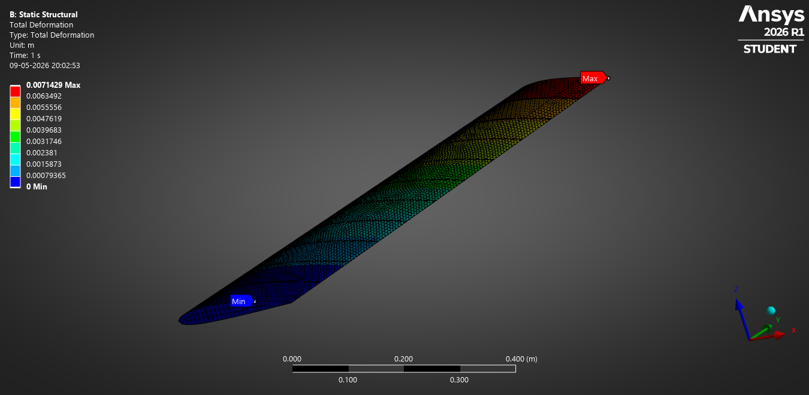
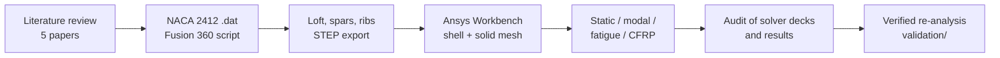

# UAV Wing: Structural FEA (Fusion 360 + Ansys)

Design and finite-element analysis of a tapered UAV wing with skin, two spars and
ten ribs. This was a 6th-semester FEA project in B.Tech Aeronautical Engineering.

* **CAD:** Autodesk Fusion 360. The NACA 2412 airfoil is imported with a Python
  script, lofted, and given spars and ribs.
* **FEA:** Ansys Workbench 2026 R1 Student. Static structural, modal (6 modes),
  stress-life fatigue, and aluminium vs CFRP.
* **Audit and re-analysis:** the saved Ansys model was checked against its own
  solver files and against hand calculations. It was then re-solved with a small,
  benchmark-verified shell FE code with a corrected set-up. The analyses that
  were missing were also added: a derived design load, mesh convergence, skin
  sizing with buckling, a real composite layup with Tsai-Wu, fatigue and flutter.

<p align="center">
  
  
</p>

## The wing

| Item | Value |
|---|---|
| Airfoil | NACA 2412 |
| Semi-span | 1.2 m |
| Chord | 0.25 m at the root to 0.20 m at the tip (taper 0.8), straight leading edge, no sweep or twist |
| Front spar | straight, at 25 % of the root chord (x = 62.5 mm), 20 × 5 mm |
| Rear spar | tapered, on the 70 % chord line, 17 × 5 mm at the root |
| Ribs | 10, about 2 mm thick, 109 mm pitch |
| Materials | aluminium alloy (E 70 GPa, ρ 2700 kg/m³); "CFRP" (E 70 GPa, ρ 1600 kg/m³) |

## Workflow



## Results of the original Ansys model

| Analysis | Aluminium | "CFRP" |
|---|---|---|
| Mass (semi-span) | 12.42 kg | 7.36 kg |
| Max total deformation | 7.14 mm | 7.14 mm |
| Max von Mises stress | 154.9 MPa | 157.9 MPa |
| Natural frequencies, modes 1–6 | 13.9, 23.9, 37.0, 63.9, 68.1, 87.7 Hz | 18.1, 31.0, 47.8, 83.0, 88.2, 113.9 Hz |
| Fatigue (zero-based, Goodman) | min. life 3.33 × 10⁶ cycles | – |

Screenshots are in [`results/`](results); the model is in [`ansys/`](ansys).

## Verification: what the numbers really say

The same wing solved three independent ways, with the same 800 Pa load:

| | Ansys model (as saved) | Beam theory, clamped root | Shell FE re-analysis, clamped root (mesh-converged) |
|---|---|---|---|
| Tip deflection | 7.14 mm | 2.86 mm | **2.70 mm** |
| Peak von Mises stress | 154.9 MPa | 10.2 MPa | **10.7 MPa** |
| 1st bending frequency | 13.9 Hz | 22.5 Hz | **22.5 Hz** |
| 1st in-plane bending | 23.9 Hz | – | **141 Hz** |
| 1st torsion | not found | – | **214 Hz** |

The two independent methods agree; the Ansys model does not. The audit
([docs/model_audit.md](docs/model_audit.md)) traces the difference to the set-up,
not to the software:

1. **Support.** The Fixed Support is on a separate root-cap surface that touches
   only the two spar end faces (8 and 13 contact nodes); the skin's root edge is
   free. The 154.9 MPa peak sits on that contact patch at the rear-spar root
   (22 MPa just 5 cm away). The soft joint also explains the extra deflection and
   the low frequencies.
2. **Load.** The 800 Pa was applied "by components" to the whole skin, so the
   lower surface is pushed up too: 434.6 N per semi-span, twice the intended
   load and about 17 g for a 5 kg UAV.
3. **"CFRP".** Modelled as isotropic with the same modulus as aluminium, so only
   the density changes. Deflection and stress are identical, and every frequency
   rises by exactly √(2700/1600) = 1.299.
4. **Mode 2** is in-plane (fore-aft) bending. **Modes 3–5** are local
   vibrations: modes 3 and 5 at the tip cap, mode 4 next to the root, most
   likely the unsupported skin edge (the root cap itself is fully fixed). No
   torsion mode is found. The fatigue life is computed at the same contact
   hotspot.

## Re-analysis and the gaps it fills ([validation/](validation/README.md))

* **Verified solver.** The shell element matches closed-form and published
  results within 1 % for plate bending, vibration, in-plane bending, plate
  buckling and the Scordelis-Lo roof. Closed-box torsion is within 3.3 %, as
  expected, because the clamped end restrains warping.
* **Design load case.** 5 kg MTOW, limit load factor 4, safety factor 1.5.
  Spanwise lift comes from lifting-line theory and is applied to the upper skin
  with the centre of pressure at 25 % chord.
* **Sizing with buckling.** Under the design load the original 8 mm skin has a
  reserve factor of about 90 on ultimate strength. A **0.5 mm aluminium skin**
  passes strength (reserve factor 10 on yield at limit load, 7.7 on ultimate
  strength) and skin buckling (1.4 × ultimate) at **1.08 kg per semi-span
  instead of 12.8 kg**.
  A 0.4 mm skin buckles below ultimate load, so **buckling, not strength, sizes
  the skin**.
* **Real composite.** T300/5208 laminates with ply-level Tsai-Wu. A 0.75 mm
  [45/-45/0]s skin is **31 % lighter** than the sized aluminium wing, deflects
  34 % less, and has a 50 % higher first frequency (Tsai-Wu strength ratio 12.5,
  buckling 2.0 × ultimate).
* **Fatigue.** Stress amplitudes of 3–14 MPa give a life above 10⁷ cycles
  for 0 → 4 g manoeuvres and ±1 g gusts.
* **Flutter / divergence.** A Theodorsen typical-section estimate puts both
  above 300 m/s for the sized wing, about 8 times an assumed 40 m/s dive
  speed. The torsion/bending frequency ratio is about 9.6.

Full tables and plots are in [validation/README.md](validation/README.md).

## Repository layout

```
cad/          Fusion 360 and STEP geometry (final and archived versions), NACA 2412 coordinates
ansys/        final Ansys Workbench project (wing_fea.wbpj + wing_fea_files/)
results/      screenshots from the original Ansys runs (aluminium, cfrp)
docs/         model audit, literature review, development log, roadmap
tools/        solver-deck inspector, beam-theory check, Fusion 360 airfoil import script
validation/   verified shell FE code (wingfe/), benchmarks, re-analysis scripts and results
```

## Reproduce

```bash
pip install -r validation/requirements.txt
python validation/benchmarks.py         # verify the element (~10 s)
python validation/run_validation.py     # re-analysis, parts A-E (~0.5-1.5 h)
python validation/run_flutter.py        # flutter / divergence estimate
python tools/beam_check.py              # hand calculation
python tools/inspect_ds_dat.py ansys/wing_fea_files/dp0/SYS-2/MECH/ds.dat
```

To open the original model: Ansys Workbench 2026 R1 (Student is enough) →
`ansys/wing_fea.wbpj`. See [ansys/README.md](ansys/README.md).

## Documentation

* [docs/model_audit.md](docs/model_audit.md): verification and known issues, with evidence
* [docs/literature_review.md](docs/literature_review.md): the five reference papers, research gaps, objectives
* [docs/development_log.md](docs/development_log.md): how the project evolved, March to May 2026
* [docs/roadmap.md](docs/roadmap.md): what is still open

The reference papers are cited with links, not redistributed.
