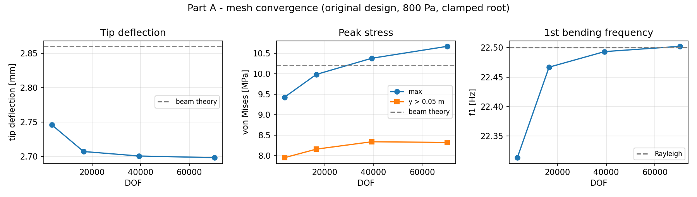
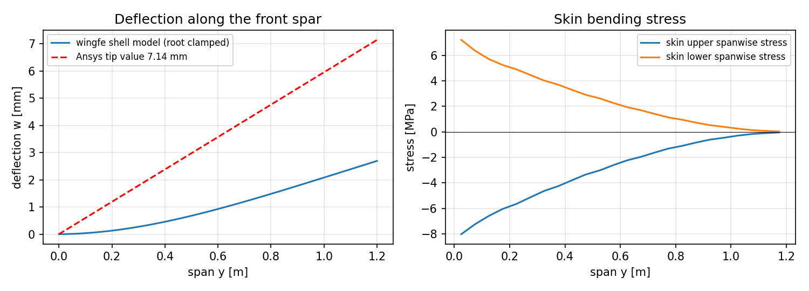
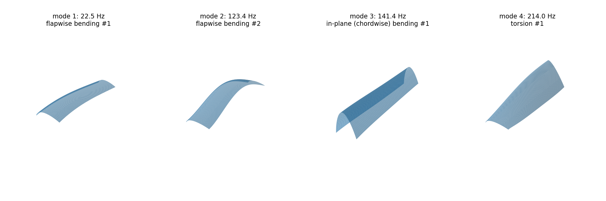
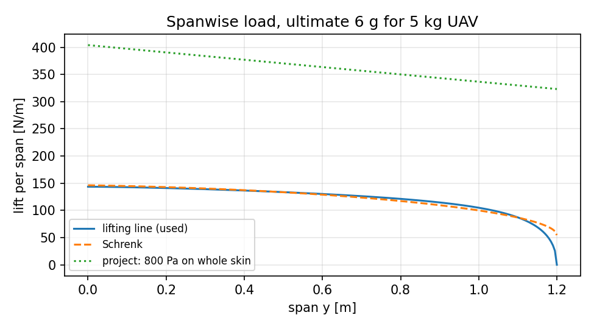
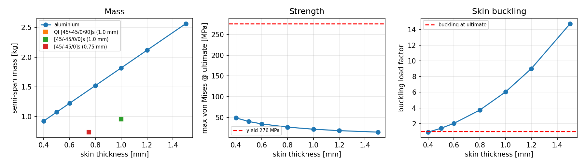
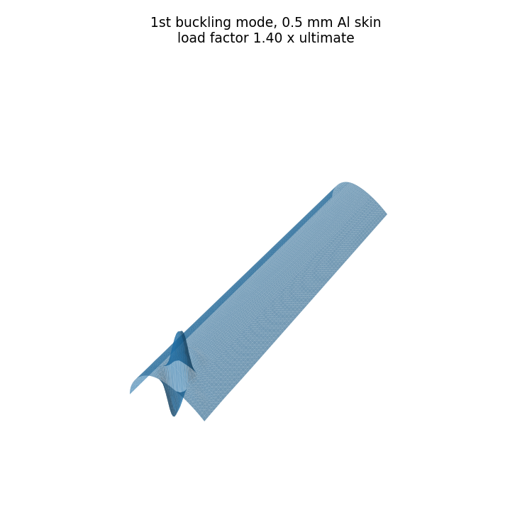

# Independent re-analysis ("validation")

The Ansys model saved in [`../ansys`](../ansys) has a support and load set-up
that drives its headline numbers (see [../docs/model_audit.md](../docs/model_audit.md)).
Ansys is not needed to re-solve the problem correctly, so this folder does it
with a small, verified shell FE code written for the purpose. It then covers
the analyses the project promised but did not complete.

```bash
pip install -r validation/requirements.txt
python validation/benchmarks.py        # element verification            (~10 s)
python validation/run_validation.py    # parts A-E                       (~20 min)
python validation/run_flutter.py       # part F, after run_validation    (~2 min)
python validation/read_ansys_results.py  # read the original Ansys .rst files
```

All outputs land in [`results/`](results).

## The code (`wingfe/`)

| Module | Content |
|---|---|
| `shell.py` | 4-node flat shell, 6 DOF per node: Q4 membrane with incompatible modes (QM6), MITC4 Reissner-Mindlin bending/shear, drilling penalty tied to the in-plane rotation, consistent mass, geometric stiffness for buckling. Takes A-B-D laminate matrices directly. |
| `materials.py` | Isotropic sections; classical lamination theory (Q̄, A, B, D, transverse shear); Tsai-Wu. T300/5208 ply data from Kaw, *Mechanics of Composite Materials*. |
| `model.py` | Sparse assembly; static (`spsolve`), modal (shift-invert Lanczos), linear buckling; effective-mass participation. |
| `wing.py` | Parametric mesh of the project wing (NACA 2412, 1.2 m semi-span, taper 0.8, spars at 25 % root chord and 70 % chord, 10 ribs plus a tip rib). Skin, webs and ribs share nodes (no contacts). Loads and stress recovery. |
| `aero.py` | Prandtl lifting-line (Glauert) and Schrenk spanwise lift. |
| `flutter.py` | Typical-section bending–torsion flutter with Theodorsen aerodynamics (V-g method) and divergence. |

### Verification ([`results/benchmarks.csv`](results/benchmarks.csv))

| Benchmark | wingfe | Reference | Error |
|---|---|---|---|
| Cantilever plate, tip deflection | 0.057111 m | 0.057146 m (Timoshenko beam) | −0.06 % |
| Cantilever plate, 1st frequency | 8.2272 Hz | 8.2252 Hz | +0.02 % |
| Deep web in in-plane bending, 10 × 1 mesh (locking test) | 5.737 mm | 5.759 mm | −0.39 % |
| Simply supported plate buckling, k = 4 | 2.539 × 10⁵ N/m | 2.531 × 10⁵ N/m | +0.33 % |
| Closed box torsion, clamped end | 6.89 × 10⁻⁴ rad | 7.13 × 10⁻⁴ rad (Bredt-Batho, free warping) | −3.3 % (end restraint) |
| Scordelis-Lo roof, 20 × 20 (curved-shell benchmark) | 0.3022 | 0.3024 | −0.05 % |
| [0]₈ / [90]₈ laminate strip, tip deflection | – | CLT D-matrix | −0.13 % / −0.09 % |
| Lifting line, elliptic wing: C_Lα | 5.3999 /rad | 5.3997 /rad | 0.00 % |
| Typical-section flutter, Hodges & Pierce example | U_F/(bω_θ) = 2.18 | ≈ 2.17 | ≈ 0.5 % |
| Rigid-body modes of the assembled wing | ‖K·r‖ / max K_ii ≈ 10⁻⁶ | 0 | – |

## Results

### Part A: original geometry and load, root clamped ([A_mesh_convergence.csv](results/A_mesh_convergence.csv))

Same geometry, thicknesses and 800 Pa as the Ansys model. The only change: the
root section (skin edge and both spar webs) is clamped, and all parts share
nodes.

| Mesh | DOF | Tip deflection | Max von Mises | Von Mises beyond y = 0.05 m | f1 flap | In-plane | Torsion |
|---|---|---|---|---|---|---|---|
| × 0.5 | 3 498 | 2.746 mm | 9.43 MPa | 7.95 MPa | 22.31 Hz | 141.2 Hz | 212.6 Hz |
| × 1.0 | 16 524 | 2.707 mm | 9.98 MPa | 8.16 MPa | 22.47 Hz | 141.3 Hz | 213.8 Hz |
| × 1.5 | 39 318 | 2.700 mm | 10.38 MPa | 8.34 MPa | 22.49 Hz | 141.4 Hz | 213.9 Hz |
| × 2.0 | 70 350 | **2.698 mm** | 10.67 MPa | **8.33 MPa** | **22.50 Hz** | **141.4 Hz** | **214.0 Hz** |

Deflection, frequencies and stress away from the root converge. The peak value
creeps up slowly at the re-entrant corner where the webs meet the clamped skin,
a mild local effect. For comparison, beam theory gives 2.86 mm, 10.2 MPa and
22.5 Hz; Ansys gave 7.14 mm, 154.9 MPa and 13.9 Hz.

With the project's isotropic "CFRP" (E 70 GPa, ρ 1600 kg/m³), the static result
is identical (2.704 mm) and f1 = 29.20 Hz, exactly 1.298 × the aluminium value.

Modes of the corrected model ([A_modes_aluminium.csv](results/A_modes_aluminium.csv)):
22.5 Hz flap 1, 123.4 Hz flap 2, 141.4 Hz in-plane 1, **214.0 Hz torsion 1**,
317.5 Hz flap 3, 567.8 Hz torsion 2, 574.9 Hz flap 4, 700.7 Hz in-plane 2.





### Part B: design load case

| Input | Value |
|---|---|
| MTOW (assumed in the project) | 5.0 kg, W = 49.05 N |
| Limit load factor / safety factor / ultimate | 4.0 / 1.5 / **6.0** |
| Wing | S = 0.54 m², AR = 10.67 |
| Lifting line | span efficiency e = 0.942, C_Lα = 5.16 /rad |
| Stall speed (C_Lmax 1.2) / manoeuvre speed | 11.1 m/s / 22.2 m/s |
| Semi-span lift, limit / ultimate | 98.1 N / **147.2 N** |

The lift distribution comes from lifting-line theory, with centre of pressure at
25 % chord. It is applied as a vertical load on the upper skin
([B_spanwise_lift_ultimate.csv](results/B_spanwise_lift_ultimate.csv)).
Inertia relief from the wing's own mass is ignored, which is conservative.

At ultimate load, **the original 8 mm design reaches 3.4 MPa (reserve factor 82
on yield) and deflects 0.8 mm**. It weighs 12.8 kg per semi-span, so both wings
together weigh 5.1 times the whole aircraft.



### Part C: aluminium skin sizing ([C_aluminium_sizing.csv](results/C_aluminium_sizing.csv))

Al 6061-T6 (Sy 276 MPa); webs 1.5 mm, ribs 1.0 mm. Strength and linear
buckling are checked at ultimate load; deflection at limit load.

| Skin | Semi-span mass | Tip deflection @ limit | Max vM @ ultimate | RF on yield | Buckling factor | f1 | Torsion | OK? |
|---|---|---|---|---|---|---|---|---|
| 0.4 mm | 0.93 kg | 10.0 mm | 49.2 MPa | 5.6 | **0.91** | 19.4 Hz | 185 Hz | no (buckles) |
| **0.5 mm** | **1.08 kg** | 8.2 mm | 40.4 MPa | 6.8 | **1.40** | 19.9 Hz | 190 Hz | **yes** |
| 0.6 mm | 1.22 kg | 7.0 mm | 34.7 MPa | 8.0 | 2.03 | 20.2 Hz | 194 Hz | yes |
| 0.8 mm | 1.52 kg | 5.4 mm | 26.9 MPa | 10.3 | 3.72 | 20.7 Hz | 199 Hz | yes |
| 1.0 mm | 1.82 kg | 4.4 mm | 21.9 MPa | 12.6 | 6.05 | 21.0 Hz | 201 Hz | yes |
| 1.5 mm | 2.56 kg | 3.0 mm | 14.9 MPa | 18.5 | 14.8 | 21.5 Hz | 205 Hz | yes |

**Skin buckling, not strength, sizes the skin.** Even the 0.4 mm skin has a
reserve factor of 5.6 on yield, but it buckles below ultimate. The first
buckling mode is a local bulge of the upper skin in the root bay.




### Part D: CFRP laminates ([D_cfrp_laminates.csv](results/D_cfrp_laminates.csv))

T300/5208 plies, 0.125 mm thick. Webs are [45/-45]s (0.5 mm) and ribs are
[0/90]s (0.5 mm), so part of the mass saving comes from lighter webs and ribs.
Ply angles are measured from the span direction. Failure is checked with
ply-level Tsai-Wu at ultimate load.

| Skin layup | Ex / Gxy | Semi-span mass | Tip @ limit | Tsai-Wu strength ratio | Buckling factor | f1 | Torsion |
|---|---|---|---|---|---|---|---|
| QI [45/-45/0/90]s, 1.0 mm | 69.7 / 26.9 GPa | 0.96 kg | 4.7 mm | 14.2 | 5.01 | 28.1 Hz | 270 Hz |
| [45/-45/0/0]s, 1.0 mm | 104.0 / 26.9 GPa | 0.96 kg | 3.1 mm | 19.7 | 4.11 | 34.4 Hz | 272 Hz |
| **[45/-45/0]s, 0.75 mm** | 77.7 / 33.5 GPa | **0.74 kg** | 5.4 mm | 12.5 | 2.05 | 29.7 Hz | 296 Hz |

Compared with the sized 0.5 mm aluminium wing, the 0.75 mm [45/-45/0]s wing is
**31 % lighter**, deflects **34 % less** and has a **50 % higher** first
frequency. This is the real composite advantage. The project's isotropic
"CFRP" (same E as aluminium) could not show it.

### Part E: fatigue, 0.5 mm aluminium design ([E_fatigue.csv](results/E_fatigue.csv))

Project S-N curve (10³…10⁷ cycles, 300…90 MPa), Goodman with Su = 310 MPa.

| Cycle | Stress used | Mean | Amplitude | Goodman equivalent | Life |
|---|---|---|---|---|---|
| 0 → 4 g manoeuvre | lower-skin spanwise tension | 12.2 MPa | 12.2 MPa | 12.7 MPa | > 10⁷ |
| 0 → 4 g manoeuvre | von Mises (project method) | 13.5 MPa | 13.5 MPa | 14.1 MPa | > 10⁷ |
| 1 g ± 0.5 g gust | lower-skin spanwise tension | 6.1 MPa | 3.0 MPa | 3.1 MPa | > 10⁷ |
| 1 g ± 1.0 g gust | lower-skin spanwise tension | 6.1 MPa | 6.1 MPa | 6.2 MPa | > 10⁷ |

All amplitudes sit far below the curve's endurance point (90 MPa at 10⁷ cycles).
They stay below it even with a stress-concentration factor of 3 at a fastener
hole. Fatigue of the skin is not critical; joints and fittings (not modelled)
are where fatigue design would focus.

### Part F: flutter and divergence estimate ([F_flutter.csv](results/F_flutter.csv))

Typical section at 75 % semi-span, with Theodorsen aerodynamics (V-g method).
Section properties come from the FE model: flexural axis at 46 % chord, centre
of gravity at 48–49 % chord. Frequencies are the FE first flap and first torsion
modes.

| Design | f_bend | f_torsion | μ | Flutter speed | Divergence speed | Flutter margin vs assumed 40 m/s dive |
|---|---|---|---|---|---|---|
| Original (8 mm Al) | 22.5 Hz | 214 Hz | 233 | 1209 m/s | 1404 m/s | 30 × |
| Sized Al (0.5 mm) | 19.9 Hz | 190 Hz | 19.4 | 314 m/s | 340 m/s | **7.8 ×** |
| CFRP QI (1.0 mm) | 28.0 Hz | 270 Hz | 17.4 | 429 m/s | 482 m/s | 10.7 × |

These speeds are far above any speed this UAV can fly, and above the range where
incompressible theory is valid. Read them as "no flutter or divergence concern",
not as exact values. The large torsion/bending frequency separation (about
9.6 : 1) of the two-spar box drives the margin. The CG sits slightly aft of the
flexural axis, so moving mass forward (for example a leading-edge spar)
would add margin.

### Limits of this re-analysis

* Shell idealisation: spars are single webs (no spar caps), no fasteners, no root
  fitting. Warping of the flat facets is below 5 × 10⁻⁶ m.
* Linear analysis; buckling is a linear eigenvalue estimate (no imperfections or
  post-buckling).
* The load uses lifting-line theory at the ultimate load factor, not CFD.
  Positive manoeuvre only.
* Material allowables are handbook values (Al 6061-T6; T300/5208 from Kaw).

